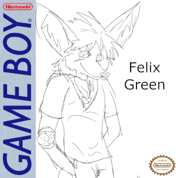

# Felix Green: Operation Grey Vanguard

Felix Green is a RPG game for the Game Boy created in GB Studio.

## Premise

Felix's arm and eye were replaced with cybernetics after he barely survives a car accident. Just as he about to settle down from the trauma, he is approached by the military who see him as a valuable asset.

## License

I license this project under the Artistic-2.0 license - see [LICENSE](LICENSE) for details.